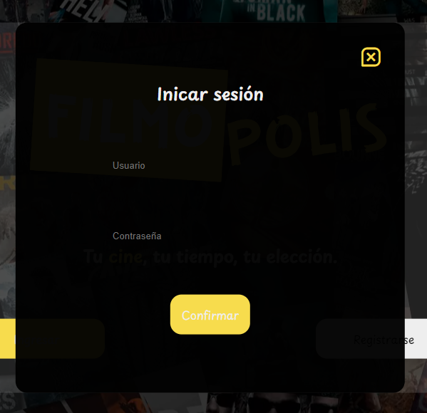
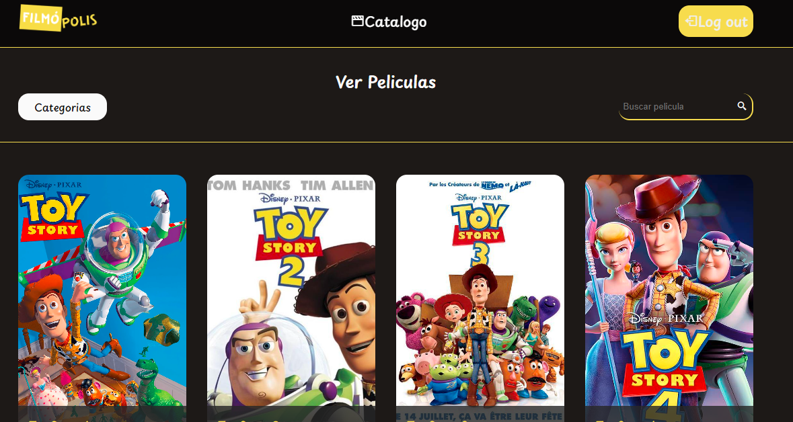
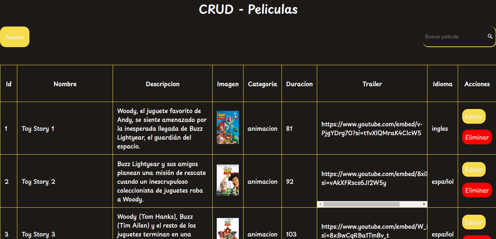

# FilmóPolis. Tu cine, tu tiempo, tu decisión.
## Indice
  - [Introduccion](#Introduccion)
  - [Enlaces](#Enlaces)
  - [Funcionamiento](#Funcionamiento)
## Introduccion
  FilmóPolis es un sitio que permite visualizar la información almacenada en una API a través de una interfaz web construida con diversas tecnologías, como VUE o JavaScript. A continuación nombraremos las principales funcionalidades de la página, diferenciando entre la vista del cliente y administrador:
  1. Formulario para ingresar
  2. Visualización de las peliculas (Vista Cliente):
     1. Ordenarlas por categoría
     2. Buscarlas por nombre
     3. Ver la información de las peliculas al hacer click
  3. CRUD (Vista Administrador):
     1. Visualizar toda la información de las peliculas, hasta la bloqueada para clientes (Como el id)
     2. Crear nuevos registros de peliculas
     3. Editar los registros existentes
     4. Eliminar registros
## Enlaces
  * [API](https://francoschendel.pythonanywhere.com/)
  * [FILMOPOLIS](https://filmopolis-codoacodo.netlify.app/)
## Funcionamiento
### Ingresar
  

    
      
    
  

  
  Esta es la pagina `index.html`. Es la primera página a la que accede el usuario, el cual necesita registrarse o iniciar sesión para ingresar.
### Cliente
  

    
  

  
  Cuando se inicia sesión con un usuario del tipo cliente accede a la página `peliculas.html`. En este tenemos la opción de ver las peliculas por categoría o buscarlas por nombre.
  

    
  

  
  Al dar click en una pelicula, el cliente se dirige a la página `info_pelicula.html` que le muestra mas en detalle los datos de la [API](https://francoschendel.pythonanywhere.com/). Vemos una imagen, título, descripción, trailer, duración e idioma.

### Administrador
  

    
  

  
  Cuando se accede a la pagina con un usuario de tipo administrador, este es redirigido a `CRUD.html`. En esta página hay una tabla con todos los datos de cada pelicula y botones que permiten modificar los datos de la [API](https://francoschendel.pythonanywhere.com/) (crear, editar y eliminar)
